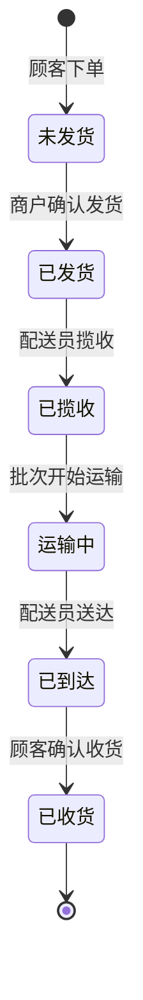
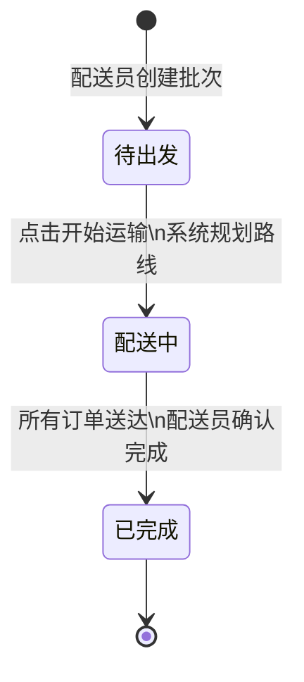
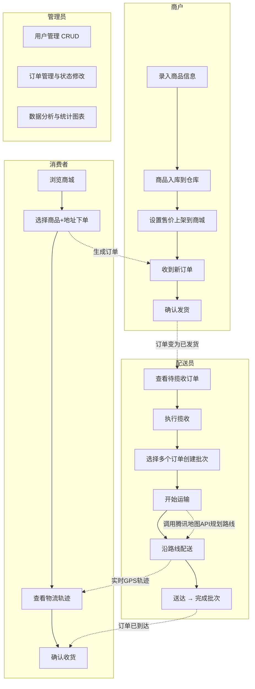
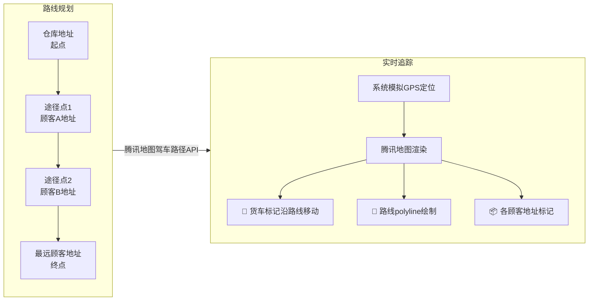

# 电商物流管理系统

Spring Boot 3.2 + Vue 3 + MySQL 全栈物流管理系统，支持管理员、商户、消费者、配送员四种角色。

## 技术栈

| 层 | 技术 |
|---|------|
| 后端 | Spring Boot 3.2 · MyBatis-Plus · JWT · MySQL 8.0 |
| 前端 | Vue 3 · Vite · Element Plus · Lucide Icons |
| 部署 | Docker Compose · GitHub Actions → GHCR |
| 地图 | 腾讯地图 JavaScript API |

## 业务流程图

### 核心物流链路


### 订单状态机



### 配送批次状态机



### 四角色完整业务流程



### 配送路线规划与实时追踪



## 功能概览

### 管理员
- 用户管理（CRUD、角色筛选、搜索）
- 订单管理（状态修改、搜索、删除）
- 数据分析（概览卡片、角色分布、订单趋势图）

### 商户
- 商城浏览、商品上架/下架/入库
- 库存管理（搜索、编辑、删除）
- 订单管理（确认、发货）
- 物流查询（地图路线、时间线、实时追踪）

### 消费者
- 商城购物（选商品、选地址、下单）
- 我的订单（状态筛选、搜索）
- 地址管理（CRUD、默认地址）
- 物流查询

### 配送员
- 待揽收 / 待送货
- 创建配送批次（多单合并）
- 批次详情与完成配送
- 历史任务

## 快速启动

```bash
git clone https://github.com/Liutianci99/grad_pilipala.git
cd grad_pilipala

cp .env.example .env
# 编辑 .env 填入数据库密码、JWT密钥等

docker compose up -d
```

| 服务 | 地址 |
|------|------|
| 前端 | http://localhost:8888 |
| 后端 | http://localhost:8080 |
| MySQL | localhost:3308 |

默认账号：任意用户名 / 密码 `123`，登录时选择角色。

## 项目结构

```
grad_pilipala/
├── .github/workflows/ci-cd.yml   # CI/CD（push main → GHCR → 服务器部署）
├── backend/
│   └── src/main/java/com/logistics/
│       ├── controller/            # 8 个 REST 控制器
│       ├── entity/                # 数据库实体
│       ├── mapper/                # MyBatis 数据访问
│       ├── service/               # 业务逻辑
│       ├── config/                # CORS、JWT、OpenAPI
│       └── util/                  # JWT 工具类
├── frontend/
│   └── src/
│       ├── views/                 # 页面（按角色分目录）
│       │   ├── admin/             # 用户管理、订单管理、数据分析
│       │   ├── merchant/          # 库存、订单、上架/下架/入库、物流
│       │   ├── consumer/          # 我的订单、地址、物流
│       │   ├── delivery/          # 揽收、配送、批次、历史
│       │   └── general/           # 商城
│       ├── assets/design.css      # 全局设计系统
│       ├── router/                # 路由配置
│       └── utils/request.js       # Axios 封装 + JWT 拦截
├── database/init.sql              # 建表 + 假数据
├── specs/                         # 项目规范
│   ├── constitution.md            # 项目宪法
│   ├── requirements.md            # 功能需求（按角色划分）
│   ├── rule.md                    # 编码规范
│   ├── api.md                     # 后端接口规范
│   └── frontend_design.md         # 前端设计规范
├── docker-compose.yml
└── .env.example
```

## CI/CD

推送到 `main` 分支自动触发：
1. 构建后端/前端 Docker 镜像
2. 推送到 GitHub Container Registry (GHCR)
3. SSH 到服务器拉取新镜像并重启

## 开发规范

详见 `specs/` 目录。新功能开发流程：
1. 更新 `specs/requirements.md`
2. 按 `rule.md` + `api.md` + `frontend_design.md` 编码
3. 功能分支 `feat/xxx` → PR → 合并到 `main`

## License

MIT
